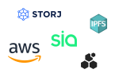

# Dagger

Decentralized Storage

Note:
Briefly describe what Dagger is.

---

## Why Dagger? 

 <!-- .element: width="30%"-->

Note:
Decentralized storage is a fundamentally unsolved problem.  
P2P storage hasn't taken off, why?  
Without reliable storage, dapps won't take off.  
Needs same guarantees as cloud storage, and then some.

---

## Reliability

predictable

accessible

Note:
Reliability is the property that is most lacking in p2p storage networks.  
Predictable storage duration.  
Storage is always accessible to you.

---

## Proofs

data possession

retrievability

Note:
How do we achieve reliability?  
Proof of data possession over time  
Proof of retrievability (interactive)

---

proof of data possession

 <!-- .element: width="60%"-->

Note:
Proof of storage.  
File is divided into chunks.  
Over time, proofs of different randomly selected chunks are requested

---

proof of data possession

 <!-- .element: width="60%"-->

Note:
We improve on this scheme by making sampling events dependent on each other.  
This increases the odds of detecting missing chunks over time.

---

proof of retrievability

  <!-- .element: width="70%"-->

Note:
Prevents data withholding (ransomware)  
The prover does not know when it's being verified

---

## Incentives

storage

bandwidth

 <!-- .element: width="60%"-->

Note:
Incentives compensate for resources  
Incentives provide security; it makes economic sense to stick to the rules  
Storage incentives provide storage reliability  
Bandwidth incentives provide retrievability (dynamic CDN)  
Incentives encourage participation in the network  

---

## Money / Investments

Note:
how much of the market can we cover  
how much would it cost to make

---

## Privacy & Anonymity

 <!-- .element: width="40%"-->

Note:
Dagger layer: identities used for incentives and payments are pseudonymous.  
Libp2p layer: peer identity is pseudonymous.  
IP layer: depending on the need, there are several solutions to choose from

---

## Network Overview

 <!-- .element: width="65%"-->

---

## Software Stack

 <!-- .element: width="70%"-->

---

## Research agenda

  - proofs for large data sets  
  - formal/emperical evidence
  - consensus engine

Note:
Small proofs, constant size, aggregatable, computationally light  
Zero knowledge proofs  
Formal proofs/emperical evidence that our algorithms have the desired properties  
Model the network to observe emergent properties  
How does the storage network interact with a consensus engine  
